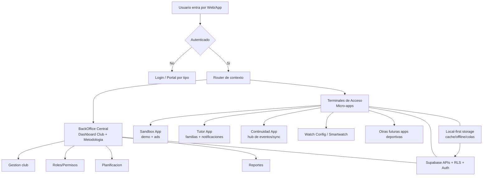
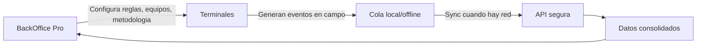

# Diagrama de plataforma: BackOffice central + Terminales de acceso

Este documento resume la arquitectura objetivo para SynqAI Sports: un **nucleo profesional (BackOffice Elite/Pro)** y un conjunto de **micro-apps/terminales especializadas** por contexto.

## 1) Diagrama general (alto nivel)

## 2) Modelo operativo recomendado

## 3) Que va en BackOffice y que va en terminal

### BackOffice central (escritorio/tablet grande)
- Configuracion avanzada del club y estructura.
- Administracion de usuarios, roles y permisos.
- Metodologia completa y operacion de alto nivel.
- Auditoria, reporting y metricas operativas.

### Terminales/micro-apps (movil/reloj/tablet de campo)
- Flujos rapidos de ejecucion (partido, entreno, incidencias, presencia).
- UX minima enfocada a una tarea por pantalla.
- Modo local-first para no depender de conectividad.
- Cola local + sincronizacion posterior.

## 4) Principios para una plataforma profesional

1. **Arquitectura por contextos**  
   Separar "gestion" (BackOffice) de "ejecucion" (terminales).

2. **Seguridad fail-closed**  
   Cada API con validacion de sesion, club, modulo y permisos.

3. **Scoping fuerte de datos**  
   Claves y entidades siempre por `clubId`, `teamId`, `sessionId`, `mode`.

4. **Offline-first real**  
   Cola de eventos local + reintentos + deduplicacion por `eventId`.

5. **Diseño responsive por prioridad**  
   - BackOffice: desktop-first.  
   - Terminales: mobile-first.

6. **Observabilidad**  
   Telemetria funcional (errores, sync, uso de acciones, ads) para decidir producto.

7. **Evolucion por micro-app**  
   Cada terminal puede iterar y desplegarse sin romper el nucleo.

## 5) Conclusión

Si: la estrategia correcta es exactamente la que indicas:  
**acceso central con BackOffice profesional + apps terminales independientes en "Terminales de acceso"**.

