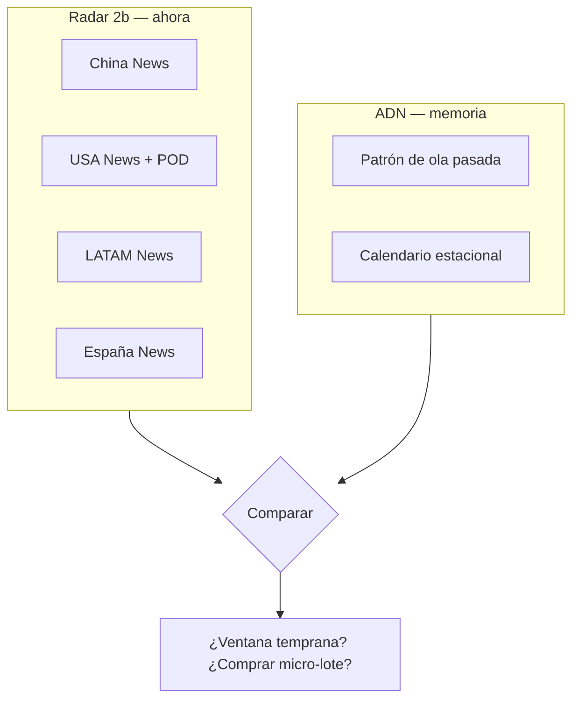

# ADN histórico — qué es y qué no es

## Tu visión (correcta)

Los ejemplos (Dumplings, Diabolo, peonzas, Labubu, cromos FIFA/Adrenalyn/Megacracks…) no son solo “productos de demo”. Son **memoria estadística del patio español**:

- Qué pidieron tus hijos en el colegio
- Qué vuelve cada X años (Diablo, Beyblade/peonzas)
- Qué es estacional (Adrenalyn ~diciembre, Megacracks ~liga, Mundial ~año de torneo)
- Qué viene de AliExpress/Amazon antes de llegar a vending

TrendPulse debe aprender **patrones de forma de ola**, no solo contar noticias de hoy.

## Qué tenemos hoy en datos

| Campo ADN | Qué es | Qué NO es |
|-----------|--------|-----------|
| `origin_peak_date` / `target_peak_date` | Fechas estimadas de la ola | Factura de ventas |
| `delay_days_to_target` | Días origen → España | Dato Panini oficial |
| `peak_search_volume` | Proxy de búsquedas | Unidades vendidas |
| `success_rate` | Acierto en vending (estimado) | Margen € real |
| `trend_corridor_delays` (LATAM) | Referencia geográfica | Scrape en vivo aún |

**No tenemos** (todavía) series de ventas de Panini, Amazon BSR ni AliExpress histórico automático.

## FIFA 2026 y el sesgo de “evento en curso”

El radar marcará fuerte cualquier álbum ligado al Mundial **mientras el torneo está activo**. Eso es correcto para **ese producto**, pero hay que separar:

- **Perfil `seasonal_mass` / `media_spike`:** FIFA, Adrenalyn, Megacracks → calendario conocido
- **Perfil `micro_viral_playground`:** Dumplings, Pop It → viral patio sin calendario fijo

El ADN sirve para decir: *“esto no es Labubu, es FIFA → comparar con 2022 y preparar Adrenalyn en diciembre”*.

## Casos que conviene añadir al ADN (contigo)

| Producto | Perfil | Notas |
|----------|--------|-------|
| Dumplings squishy | micro_viral | Ya en radar + ADN |
| Diabolo / yo-yo | kidult_nostalgia / recurrente | Oleadas cada varios años |
| Peonzas / Beyblade | micro_viral / recurrente | Patio + AliExpress |
| Adrenalyn XL | seasonal_mass | ~diciembre |
| Megacracks / La Liga | seasonal_mass | ~agosto–septiembre |
| AliExpress genérico | origen `asia` | Delay importación → patio |

Fuente AliExpress (tu enlace): encaja como **origen marketplace** en Fase 2c — scrape de “sold / trending” en categoría juguetes.

## Cómo encaja radar + ADN

## Roadmap datos de ventas reales

1. **Manual:** tú validas fechas de patio (“Diablo otra vez en marzo 2025”)
2. **Semi-auto:** Amazon “Movers & Shakers” juguetes ES (Fase 2c)
3. **AliExpress:** categoría hot / orders (difícil, anti-bot)
4. **Operador:** datos Jofemar / vending (futuro B2B)

## Descubrimiento sin decir el producto (Radar 3)

El scanner por **categoría** (“blind box agotado”, “juguete patio viral”) generará candidatos nuevos. Tú apruebas → entran al ADN → el sistema aprende otro patrón.

Los 5 pilotos actuales son **entrenamiento del motor**, no el producto final.
