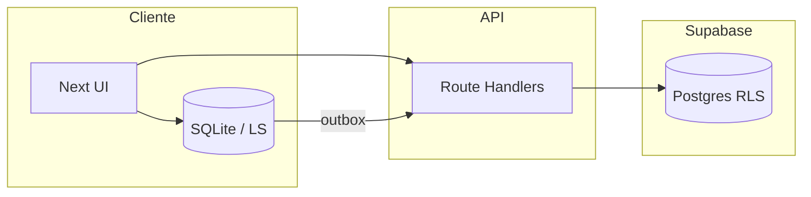

# Arquitectura técnica — SynqAI Sports (visión consolidada)

Documento de **Fase 2**: mapa del sistema para onboarding de ingeniería y decisiones de producto. Complementa `PLAN_MAESTRO.md` (rutas/clases) y `PRODUCT_MATRIX.md` (productos).

## 1. Stack y despliegue

| Capa | Tecnología |
|------|------------|
| App web | Next.js 15 (App Router), React 19, Tailwind |
| Backend datos | Supabase (Postgres, Auth, RLS) |
| API interna | Route Handlers `src/app/api/*` (validación, service role, guards) |
| Cliente offline | `sql.js` + `localStorage` (fallback), outbox → `/api/sync/outbox` |
| Android | Capacitor 7 WebView → URL producción o dev (`docs/CAPACITOR_ANDROID.md`) |

## 2. Identidad y sesión

- **Supabase Auth** (`auth.users`) + **`profiles`** (rol, club por defecto, `preferred_locale`).
- **Membresías multi-club**: `club_memberships` (fuente de verdad progresiva; `profiles.club_id` compatibilidad).
- **Middleware** (`src/middleware.ts`): rutas `/dashboard`, `/admin-global` protegidas; comprobación fina de rol en layouts cliente.
- **Sesión club en API**: `verifyClubSessionFromRequest` + Bearer en rutas operativas.

## 3. Modelo de datos (resumen)

- **Club operativo**: metodología, warehouse, academy, operativa sesiones/asistencia, torneos (mix local + Supabase según módulo).
- **Sandbox / promo**: estado principal en cliente (`synq_promo_*` + SQLite `documents`); telemetría y leads vía API → Supabase.
- **Colas abiertas**: `ad_events_queue` (anon insert en preview), `sandbox_device_snapshots` (outbox anon), `sandbox_terminal_leads` (solo service role).
- **Continuidad**: `operativa_mobile_incidents` con RLS por club; promoción idempotente **Fase 6** (`sync_key` + `/api/sync/promote-continuity`).

## 4. Flujos críticos

- **Ads / analytics**: cliente → `/api/ads/events` → `ad_events_queue`.
- **Outbox genérico**: cliente → `/api/sync/outbox` → `sandbox_device_snapshots` (telemetría).
- **Incidencias con club**: cliente autenticado → `/api/operativa/incidents` o `/api/sync/promote-continuity` → `operativa_mobile_incidents`.

## 5. Límites web vs nativo

| Capacidad | Web (PWA) | Android (Capacitor) |
|-----------|-----------|---------------------|
| UI Sandbox / club | Sí | WebView misma URL |
| SQLite embebido | sql.js | Mismo origen |
| BLE / background | Limitado | Roadmap nativo / plugins |
| AdSense | Política `ads-policy.ts` | AdMob (futuro) |

## 6. Documentación relacionada

- Rutas y clasificación: `PLAN_MAESTRO.md`
- Productos y URLs: `PRODUCT_MATRIX.md`, `docs/apps/*`
- Outbox: `OUTBOX_SYNC.md`, `DELIVERABLES_ROADMAP.md` (Fase 4 y 6)
- Android: `CAPACITOR_ANDROID.md`
- i18n / 50 países: **`I18N_AND_GLOBAL.md`**
- SQL: `SUPABASE_MIGRATIONS_AUDIT.md`
